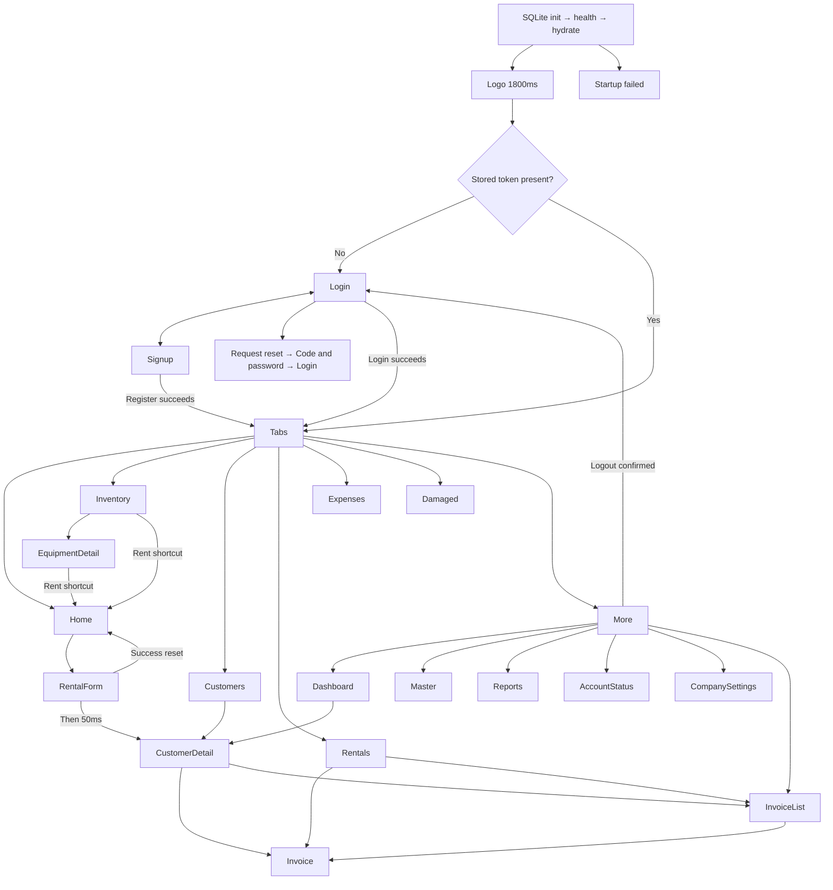

# Navigation map

Tab order is **Home, Inventory, Customers, Rentals, Expenses, Damaged, More**; initial tab Home. Root authenticated stack contains MainTabs plus Dashboard, Master, Reports, AccountStatus, EquipmentDetail, CustomerDetail, RentalForm, Invoice, InvoiceList, CompanySettings. Auth screens hide native headers; other stack headers use explicit theme colors.

All normal tab header bells open `Dashboard({scrollToAlerts:true})`. Dashboard shortcuts target Inventory, Damaged, Rentals, Customers, Reports and Master. Reports links are conditionally shown based on `analytics` in More/Dashboard; this is not a global navigation guard.

## Route arguments

| Route | Arguments |
|---|---|
| Dashboard | optional `scrollToAlerts:boolean` |
| EquipmentDetail | `equipmentId:string` |
| CustomerDetail | `customerId:string` |
| RentalForm | customer `{id,name,phone?,photo_url?}`; items `{id,name,rent_per_day,stock_count,quantity?}[]` |
| Invoice | `rentalId:string` |
| Home nested route | runtime `focusEquipmentName` and `resetToken` used despite absent declarations in TabParamList |
| MainTabs nested navigation | runtime `{screen,params}` used despite declared `undefined` |

Use typed Flutter arguments that retain these currently untyped paths. Preserve native back stack, modal dismiss/back, selected-tab state and keyboard behavior in runtime tests. Source declarations alone do not settle every back-stack detail.

Return from Rentals/CustomerDetail: if `paymentQrCode` allowed, show QR before navigation; after dismissal individual goes Invoice and batch goes InvoiceList. If denied, navigate directly. EquipmentDetail return closes return form and optionally shows QR, without invoice navigation. Logout removes session keys, clears query cache, resets root to Login; it does not delete preferences or cloud drafts.
